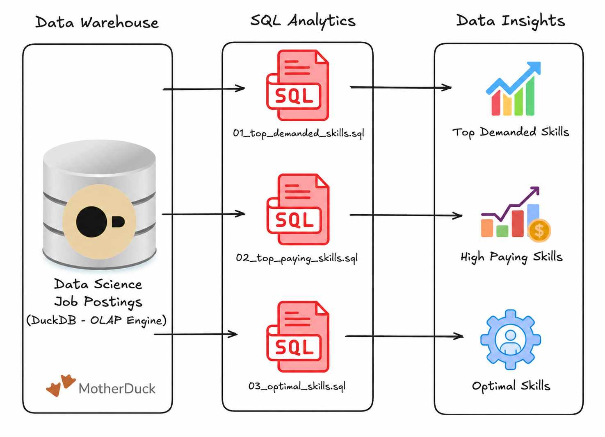

# 📊 Exploratory Data Analysis with SQL: UK and Global Job Market Analysis

An SQL project analysing the data engineer job market in the uk for non remote jobs and globally for remote jobs using real world job posting data. It demonstrates my ability to **write production-quality analytical SQL, design efficient queries, and turn business questions into data-driven insights**.

## Executive Summary

- ✅ **Project scope:** Built **3 analytical queries** that answer key questions about the data engineer job market in the uk and globally 
- ✅ **Data modeling:** Used **multi-table joins** across fact and dimension tables to extract insights  
- ✅ **Analytics:** Applied **aggregations, filtering, and sorting** to find top skills by demand, salary, and overall value  
- ✅ **Outcomes:** Delivered **actionable insights** on SQL/Python dominance, cloud trends, and salary patterns

For brevity review these:

1. [`01_top_demanded_skills.sql`](.\01_top_demmanded_skills.sql) – demand analysis with multi-table joins  
2. [`02_highest-paying_skills.sql`](.\02_highest-paying_skills.sql) – salary analysis with aggregations  
3. [`03_most_optimal_skills.sql`](.\03_most_optimal_skills.sql) – combined demand/salary optimization query  

## Problem & Context

Typically job market analysts answer questions like:

- 🎯 **Most in-demand:** *Which skills are most in-demand?*  
- 💰 **Highest paid:** *Which skills command the highest salaries?*  
- ⚖️ **Best trade-off:** *What is the optimal skill set balancing demand and compensation?*  

This project analyses a Duckdb **data warehouse** built using a star schema design. The warehouse structure consists of:

- **Fact Table:** `job_postings_fact` - Central table containing job posting details (job titles, locations, salaries, dates, etc.)
- **Dimension Tables:** 
  - `company_dim` - Company information linked to job postings
  - `skills_dim` - Skills catalog with skill names and types
- **Bridge Table:** `skills_job_dim` - Resolves the many-to-many relationship between job postings and skills

By querying across these interconnected tables, I extracted insights about skill demand, salary patterns, and optimal skill combinations for data engineering roles.  

## Tech Stack

- 🐤 **Query Engine:** DuckDB for fast OLAP-style analytical queries  
- 🧮 **Language:** SQL 
- 📊 **Data Model:** Star schema with fact + dimension + bridge tables  
- 🛠️ **Development:** VS Code for SQL editing + Terminal for DuckDB CLI  
- 📦 **Version Control:** Git/GitHub for versioned SQL scripts  

## Analysis Overview

### Query Structure

1. **[Top Demanded Skills For non-remote workers in the UK](.\01_top_demmanded_skills.sql)** – Identifies the 10 most in-demand skills for non-remote data engineer positions in the UK
2. **[Top Paying Skills for non-remote data engineers in the UK](.\02_highest-paying_skills.sql)** – Analyzes the 25 highest-paying skills with salary and demand metrics
3. **[Optimal Skills for remote data engineers globally](.\03_most_optimal_skills.sql)** – Calculates an optimal score using natural log of demand combined with median salary to identify the most valuable skills to learn

### Key Infomation:

- 📖 Best languages: SQL and Python each appear in ~15-14000 job postings, making them the most demanded skills
- ☁️ Cloud platforms: Azure and AWS are the most popular cloud platforms in the UK for both remote and non-remote data engineering for roles 
- 📈 Premium tech: Statistical Analysis System (sas) was found to be the highest paying tool for data engineers, highlighting the importance of advanced analytics and business intelligence for data engineers in the UK
- 👷‍♂️ Orchestration tools: Airflow is functionally  lonesome as the best all round orchestration tool for data engineers in the UK

### Graphical insights

Key tables were processed by openAI's ChatGPT in order to produce the graphs above.
## SQL Skills Demonstrated

### Query Design & Optimisation

- **Complex Joins**: Multi-table `INNER JOIN` operations across `job_postings_fact`, `skills_job_dim`, and `skills_dim`
- **Aggregations**: `COUNT()`, `MEDIAN()`, `ROUND()` for statistical analysis
- **Filtering**: Boolean logic with `WHERE` clauses and multiple conditions (`job_title_short`, `job_work_from_home`, `salary_year_avg IS NOT NULL`)
- **Sorting & Limiting**: `ORDER BY` with `DESC` and `LIMIT` for top-N analysis

### Data Analysis Techniques

- **Grouping**: `GROUP BY` for categorical analysis by skill
- **Conditional Logic**: `CASE WHEN` statements for derived metrics
- **Mathematical Functions**: `LN()` for natural logarithm transformation to normalize demand metrics
- **Calculated Metrics**: Derived optimal score combining log-transformed demand with median salary
- **HAVING Clause**: Filtering aggregated results (skills with > 100 postings)
- **NULL Handling**: Proper filtering of incomplete records (`salary_year_avg IS NOT NULL`)
