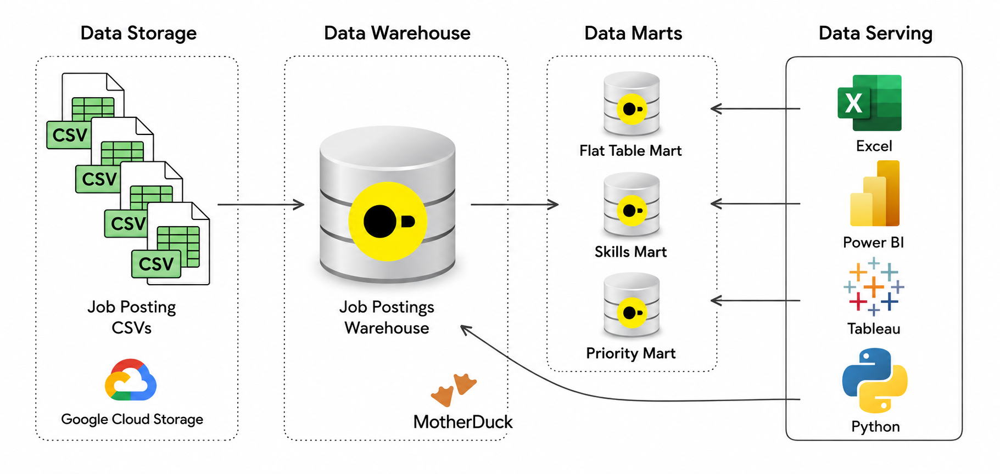

# 🛠️Data Engineering Projects with SQL  

This is a guided project I completed as a part of **Luke Barousse's Data Engineer Bootcamp - SQL, Python, Cloud, Bash, AI, Git & GitHub project**, which has taught me the fundamentals of data engineering and even analytical engineering.

For the first analytical project in particular, I made sure to focus my queries on the UK job market, as this would give me an early insight into the most relevant skills I would need for my future tech stack after completing the course.

By completing these projects, I have significantly strengthened my SQL abilities, while also gaining new technologies such as Bash, Git and GitHub. This project has given me a deeper understanding of the ETL/ELT pipeline. ✌️

# [Exploratory data analysis of UK and global Job market for data engineers](1_EDA)
 
> ## In this project I showcase my ability to write SQL queries to find insightful metrics on data engineers working non-remote in the Uk and those working in remote positions globally.

# [Data Warehouse & Mart Build: Production ETL Pipeline](2_DW_Mart_Build)

> ## This end-to-end data engineering pipeline that transforms raw CSV files from Google Cloud Storage into a normalised star schema data warehouse, then builds analytical data marts.
